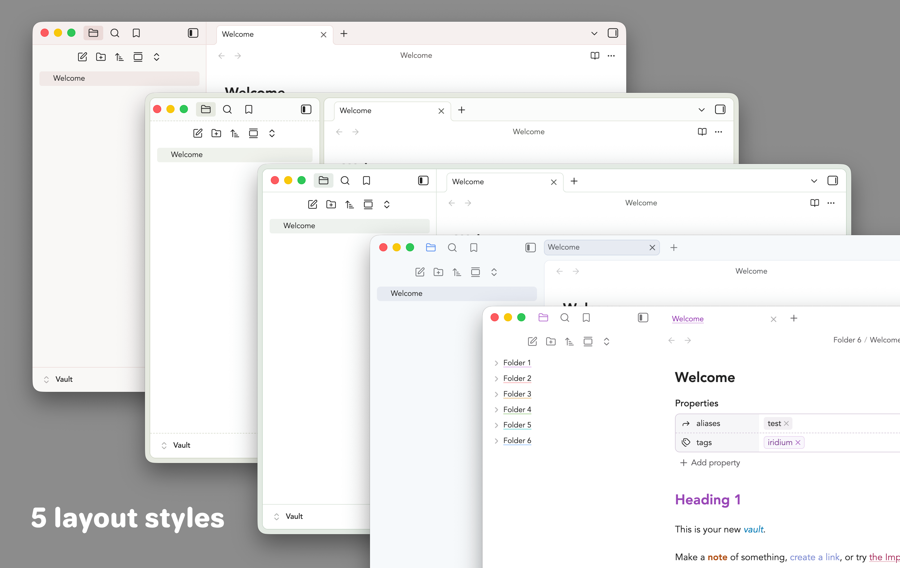
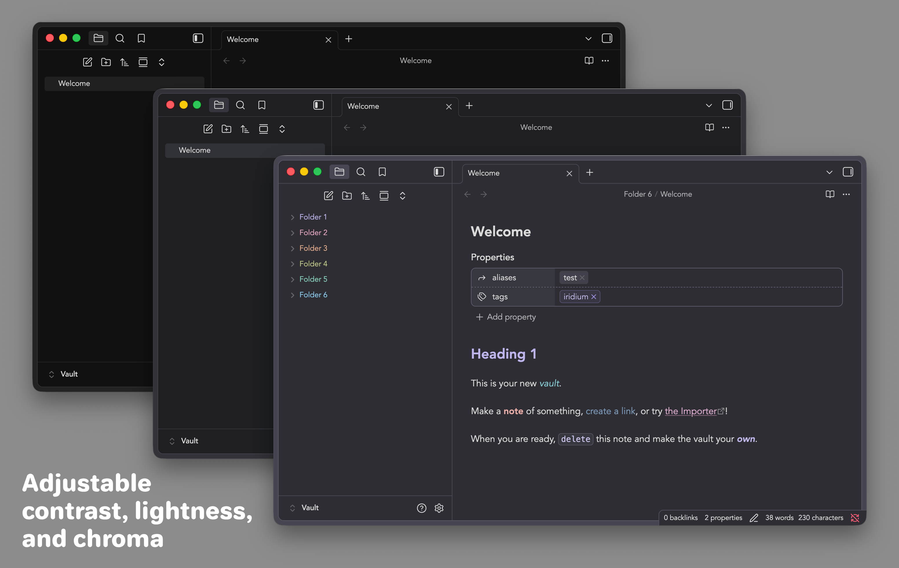
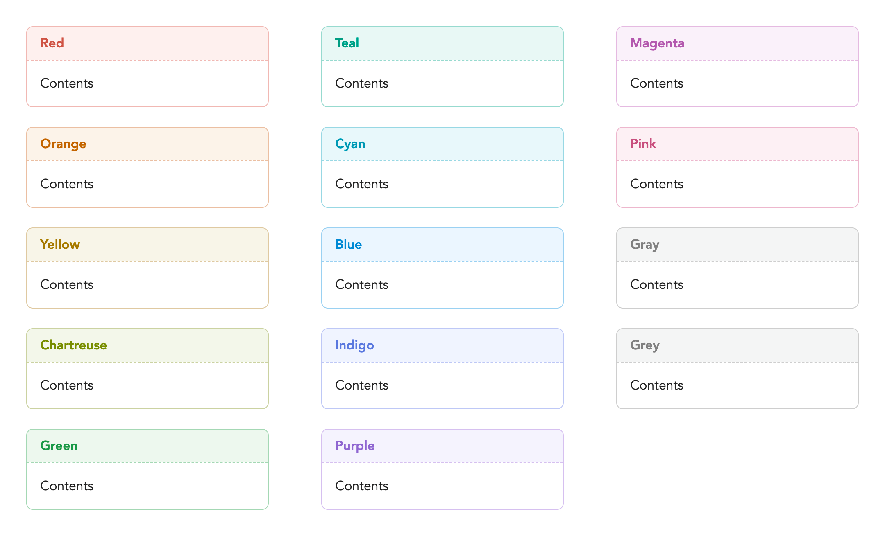
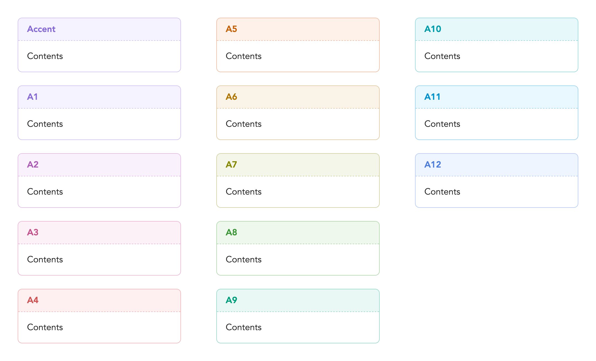
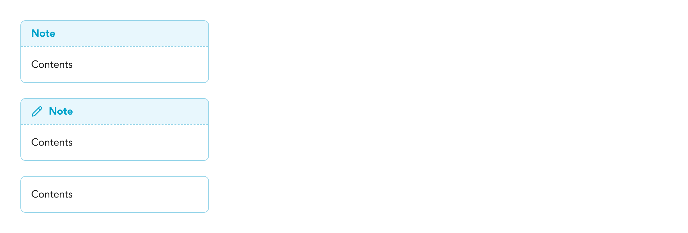
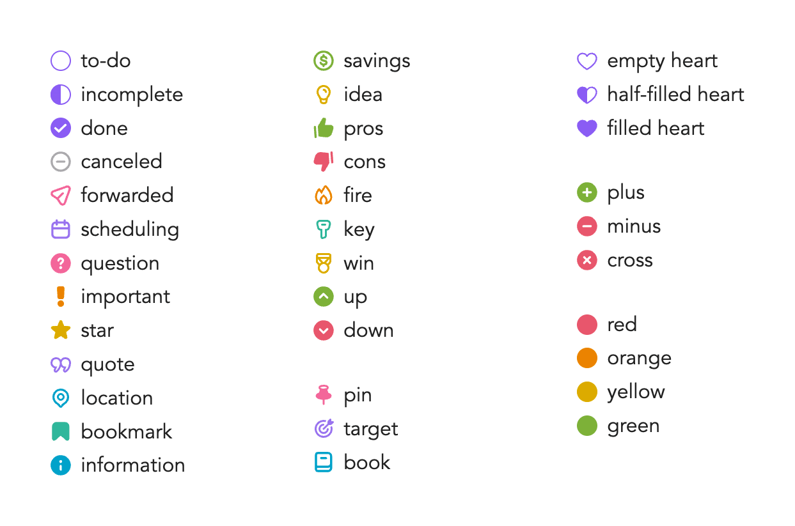

# Iridium
Iridium is a customizable theme for Obsidian based on your accent color.

## Screenshots




## Callouts
### Callout types
#### Named colors


#### Accent-based colors


### Callout metadata


- `no-icon` hides the icon
- `icon` shows the icon even if the 'Hide icons' setting is enabled
- `no-title` hides the title

```
# Callout types

## Named colors

> [!red]
> Contents

> [!orange]
> Contents

> [!yellow]
> Contents

> [!chartreuse]
> Contents

> [!green]
> Contents

> [!teal]
> Contents

> [!cyan]
> Contents

> [!blue]
> Contents

> [!indigo]
> Contents

> [!purple]
> Contents

> [!magenta]
> Contents

> [!pink]
> Contents

> [!gray]
> Contents

> [!grey]
> Contents


## Accent-based colors

> [!accent]
> Contents

> [!a1]
> Contents

> [!a2]
> Contents

> [!a3]
> Contents

> [!a4]
> Contents

> [!a5]
> Contents

> [!a6]
> Contents

> [!a7]
> Contents

> [!a8]
> Contents

> [!a9]
> Contents

> [!a10]
> Contents

> [!a11]
> Contents

> [!a12]
> Contents


# Callout metadata

> [!note|no-icon]
> Contents

> [!note|icon]
> Contents

> [!note|no-title]
> Contents
```

## Alternative checkboxes


```
- [ ] to-do
- [/] incomplete
- [x] done
- [-] canceled
- [>] forwarded
- [<] scheduling
- [?] question
- [!] important
- [*] star
- ["] quote
- [l] location
- [b] bookmark
- [i] information
- [S] savings
- [I] idea
- [p] pros
- [c] cons
- [f] fire
- [k] key
- [w] win
- [u] up
- [d] down

- [n] pin
- [t] target
- [a] book
- [1] empty heart
- [2] half-filled heart
- [3] filled heart
- [4] plus
- [5] minus
- [6] cross
- [7] red
- [8] orange
- [9] yellow
- [0] green
```

## Styled plugins
- Calendar
- Notebook Navigator
- Style Settings
- Vertical Tabs

## Installation
1. In Obsidian, open **Settings**
2. Go to **Appearance**
3. In **Themes**, click **Manage**
4. Search for '**Iridium**'
5. Click **Install and use**

To customize Iridium, you need to install the **Style Settings** plugin.
1. Open **Settings**
2. Go to **Community plugins**
3. Click **Browse**
4. Search for '**Style Settings**'
5. Click **Install**, then click **Enable**, then click **Options**

## Credits
Since themes tend to borrow a lot of ideas from each other, it's hard to keep track of where specific features come from and credit everyone properly. So instead, I decided to make a list of my favorite themes. Some themes inspired me, while others are just much cooler than my theme and deserve a shoutout. I will keep this list updated. (Do check them out!)

- [Aubade](https://github.com/DuckTapeKiller/obsidian-aubade)
- [Baseline](https://github.com/aaaaalexis/obsidian-baseline)
- [blobob](https://github.com/kazi-aidah/blobob)
- [Border](https://github.com/akifyss/obsidian-border)
- [Composer](https://github.com/vran-dev/obsidian-composer)
- [Cupertino](https://github.com/aaaaalexis/obsidian-cupertino)
- [Elysian](https://github.com/matothetomato/Elysian)
- [Fancy-a-Story](https://github.com/elsatam/obsidian-fancy-a-story)
- [flexcyon](https://github.com/bladeacer/flexcyon)
- [Hidden Grotto](https://github.com/hotandcold245/Hidden-Grotto)
- [Maple](https://github.com/subframe7536/obsidian-theme-maple)
- [Minimal](https://github.com/kepano/obsidian-minimal)
- [Museifu Basic](https://github.com/account-not-relevant/museifu-basic-theme)
- [Nostromo](https://github.com/gvorbeck/Nostromo)
- [Planetz Roller](https://github.com/monoooki/obsidian-planetz-roller-theme)
- [Primary](https://github.com/primary-theme/obsidian)
- [Prism](https://github.com/damiankorcz/Prism-Theme)
- [Retroma](https://github.com/emarpiee/Retroma)
- [TerraFlow](https://github.com/dubefab/obsidian-TerraFlow)
- [Ultra Lobster](https://github.com/7368697661/Ultra-Lobster)
- [Underwater](https://github.com/seniblue/Underwater)
- [Velocity](https://github.com/Gonzalo-D-Sales/obsidian-velocity)
- [Willemstad](https://github.com/tingmelvin/willemstad-x)

## Links
- [GitHub repo](https://github.com/kyffa/Iridium)
- [Release notes](https://github.com/kyffa/Iridium/releases)
- [Obsidian Community listing](https://community.obsidian.md/themes/iridium)

Last updated: 2026-09-14
