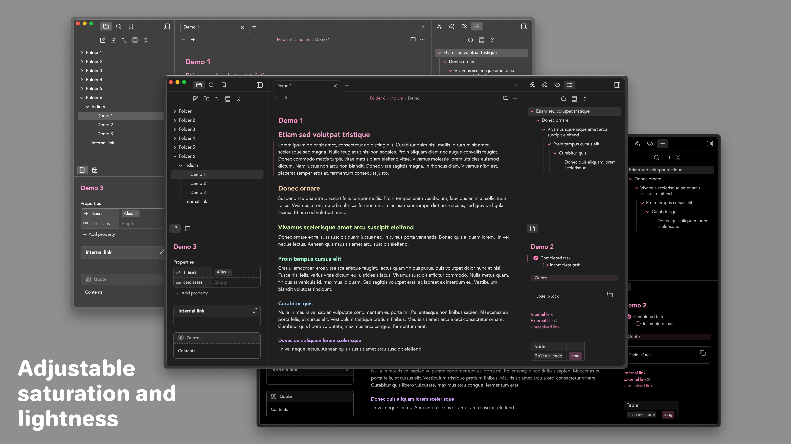

# Iridium
Iridium is a pretty, comfortable, and customizable theme that emphasizes your accent color.

## Installation
Iridium is available on the community themes list in Obsidian. To install: 
1. Go to **Settings** > **Appearance**
2. Under **Themes**, click **Manage**
3. Search for '**Iridium**'
4. Click **Install and use**

To customize Iridium, you need to install the **Style Settings** plugin.
1. Go to **Settings** > **Community plugins**
2. Click **Browse**
3. Search for '**Style Settings**'
4. Click **Install**, then click **Enable**, then click **Options**

## Credits
Inspiration and ideas taken from:
- [Border](https://github.com/Akifyss/obsidian-border) by Akifyss
- [Primary](https://github.com/primary-theme/obsidian) by ceciliamay
- [Minimal](https://github.com/kepano/obsidian-minimal) by kepano
